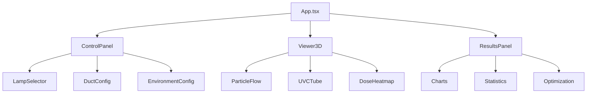
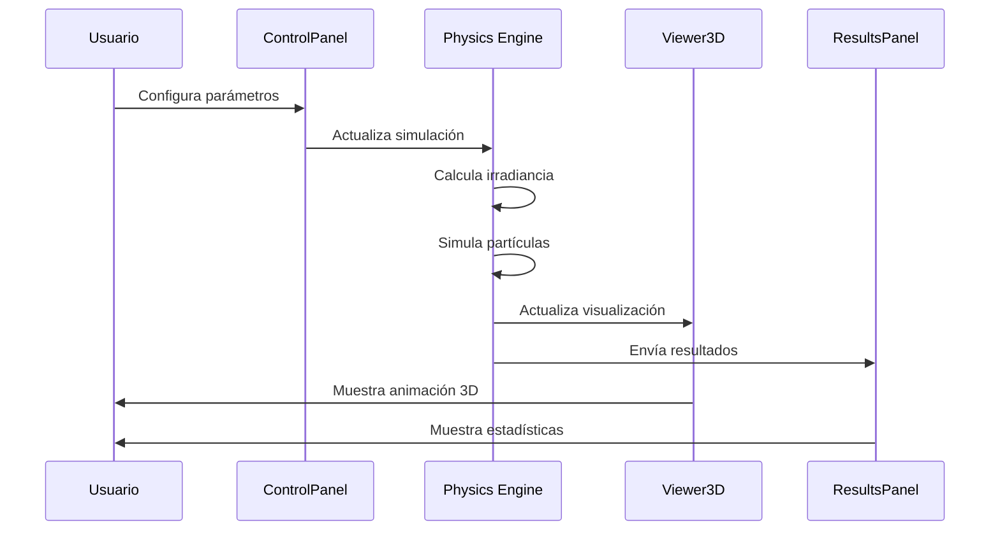

# 🏗️ Arquitectura del Sistema

## Visión General

El Calculador UV-C es una aplicación web moderna construida con React, TypeScript y Three.js que simula la dosis de radiación UV-C en sistemas de ductos HVAC.

## Stack Tecnológico

### Frontend
- **React 18.2**: Framework de UI con hooks y concurrent features
- **TypeScript 5.0**: Type safety y mejor DX
- **Three.js + R3F**: Visualización 3D WebGL
- **Tailwind CSS**: Estilos utility-first
- **Chart.js**: Visualización de datos
- **Vite**: Build tool y dev server

### Herramientas
- **ESLint**: Linting de código
- **Prettier**: Formateo de código
- **Vitest**: Testing unitario
- **Playwright**: Testing E2E

## Arquitectura de Componentes



## Flujo de Datos



## Módulos Principales

### 1. Physics Engine (`/src/physics/`)

#### `uvCalculations.ts`
```typescript
export interface UVCalculationParams {
  lampPower: number;      // Potencia UV-C (W)
  tubeLength: number;     // Longitud del tubo (m)
  reflectivity: number;   // Factor de reflexión (0-1)
  temperature: number;    // Temperatura (°C)
  humidity: number;       // Humedad relativa (%)
}

export function calculateIrradiance(
  params: UVCalculationParams,
  distance: number
): number {
  // Modelo de fuente lineal
  const linearPower = params.lampPower / params.tubeLength;
  const baseIrradiance = linearPower / (2 * Math.PI * distance);
  
  // Factores ambientales
  const tempFactor = 1 - (params.temperature - 20) * 0.002;
  const humidityFactor = 1 - (params.humidity - 50) * 0.003;
  
  // Factor de reflexión
  const reflectionMultiplier = 1 + params.reflectivity * 0.5;
  
  return baseIrradiance * tempFactor * humidityFactor * reflectionMultiplier;
}
```

#### `tubePositioning.ts`
```typescript
export function generateOptimizedTubePositions(
  params: SimulationParams
): TubePosition[] {
  const positions: TubePosition[] = [];
  const wallDistance = 6; // cm desde las paredes
  
  // Algoritmo de distribución inteligente
  if (params.numberOfTubes === 1) {
    // Un tubo: parte inferior
    positions.push({
      x: 0,
      y: -params.ductHeight/2 + wallDistance,
      z: 0
    });
  } else if (params.numberOfTubes === 2) {
    // Dos tubos: laterales
    positions.push(
      { x: -params.ductWidth/2 + wallDistance, y: 0, z: 0 },
      { x: params.ductWidth/2 - wallDistance, y: 0, z: 0 }
    );
  }
  // ... más configuraciones
  
  return positions;
}
```

### 2. Optimization Module (`/src/optimization/`)

#### Algoritmo Genético
```typescript
export class GeneticAlgorithm {
  private population: Chromosome[];
  private fitnessFunction: (c: Chromosome) => number;
  
  evolve(generations: number): Solution {
    for (let gen = 0; gen < generations; gen++) {
      // Selección
      const parents = this.selection();
      
      // Cruce
      const offspring = this.crossover(parents);
      
      // Mutación
      this.mutate(offspring);
      
      // Reemplazo
      this.population = this.replacement(offspring);
    }
    
    return this.getBestSolution();
  }
}
```

#### Particle Swarm Optimization
```typescript
export class PSO {
  private particles: Particle[];
  private globalBest: Position;
  
  optimize(iterations: number): Solution {
    for (let i = 0; i < iterations; i++) {
      for (const particle of this.particles) {
        // Actualizar velocidad
        particle.velocity = this.updateVelocity(particle);
        
        // Actualizar posición
        particle.position = this.updatePosition(particle);
        
        // Evaluar fitness
        const fitness = this.evaluate(particle.position);
        
        // Actualizar mejores
        this.updateBests(particle, fitness);
      }
    }
    
    return this.globalBest;
  }
}
```

### 3. 3D Visualization (`/src/components/`)

#### Sistema de Partículas
```typescript
export function ParticleFlow({ tubePositions, lampPower }) {
  const particles = useRef<Particle[]>([]);
  
  useFrame((state, delta) => {
    particles.current.forEach(particle => {
      // Mover partícula
      particle.position.z += airVelocity * delta;
      
      // Calcular dosis acumulada
      const irradiance = calculateIrradianceAtPoint(
        particle.position,
        tubePositions,
        lampPower
      );
      
      particle.dose += irradiance * delta;
      
      // Actualizar color según dosis
      particle.color = doseToColor(particle.dose);
    });
  });
  
  return <Points positions={particles} />;
}
```

## API de Cálculo

### Endpoint Principal
```typescript
interface CalculationRequest {
  duct: {
    width: number;    // cm
    height: number;   // cm
    length: number;   // cm
  };
  lamp: {
    id: string;
    count: number;
  };
  environment: {
    airVelocity: number;     // m/s
    temperature: number;     // °C
    humidity: number;        // %
    reflectivity: number;    // %
  };
}

interface CalculationResponse {
  dose: {
    average: number;         // mJ/cm²
    minimum: number;         // mJ/cm²
    maximum: number;         // mJ/cm²
    stdDev: number;          // mJ/cm²
  };
  uniformity: number;        // %
  efficiency: number;        // %
  exposureTime: number;      // seconds
  recommendation: string;
}
```

## Patrones de Diseño

### 1. Observer Pattern
```typescript
// Sistema de eventos para actualización de UI
class SimulationObserver {
  private observers: Observer[] = [];
  
  subscribe(observer: Observer) {
    this.observers.push(observer);
  }
  
  notify(data: SimulationResults) {
    this.observers.forEach(o => o.update(data));
  }
}
```

### 2. Factory Pattern
```typescript
// Creación de algoritmos de optimización
class OptimizerFactory {
  static create(type: 'genetic' | 'pso' | 'annealing'): Optimizer {
    switch(type) {
      case 'genetic': return new GeneticAlgorithm();
      case 'pso': return new PSO();
      case 'annealing': return new SimulatedAnnealing();
    }
  }
}
```

### 3. Strategy Pattern
```typescript
// Diferentes estrategias de cálculo
interface CalculationStrategy {
  calculate(params: SimulationParams): SimulationResults;
}

class LinearSourceStrategy implements CalculationStrategy {
  calculate(params: SimulationParams): SimulationResults {
    // Implementación con modelo de fuente lineal
  }
}

class PointSourceStrategy implements CalculationStrategy {
  calculate(params: SimulationParams): SimulationResults {
    // Implementación con modelo de fuente puntual
  }
}
```

## Performance

### Optimizaciones Implementadas

1. **Memoización**: Cache de cálculos costosos
```typescript
const memoizedIrradiance = useMemo(
  () => calculateIrradiance(params),
  [params]
);
```

2. **Web Workers**: Cálculos pesados en threads separados
```typescript
const worker = new Worker('/calculateWorker.js');
worker.postMessage({ type: 'CALCULATE', params });
```

3. **LOD (Level of Detail)**: Reducción de calidad según distancia
```typescript
const LOD = distance > 100 ? 'low' : distance > 50 ? 'medium' : 'high';
```

4. **Instanced Rendering**: Para múltiples tubos UV-C
```typescript
<InstancedMesh count={tubeCount}>
  <cylinderGeometry />
  <meshStandardMaterial />
</InstancedMesh>
```

## Seguridad

### Validación de Entrada
```typescript
const validateParams = (params: SimulationParams): boolean => {
  return (
    params.ductWidth >= 10 && params.ductWidth <= 200 &&
    params.ductHeight >= 10 && params.ductHeight <= 200 &&
    params.numberOfTubes >= 1 && params.numberOfTubes <= 12 &&
    params.airVelocity >= 0.5 && params.airVelocity <= 10
  );
};
```

### Sanitización
```typescript
const sanitize = (input: string): string => {
  return DOMPurify.sanitize(input);
};
```

## Testing

### Unit Tests
```typescript
describe('UV Calculations', () => {
  it('should calculate correct irradiance', () => {
    const result = calculateIrradiance({
      lampPower: 31.3,
      tubeLength: 1.2,
      distance: 0.2,
      reflectivity: 0.7
    });
    
    expect(result).toBeCloseTo(41.5, 1);
  });
});
```

### Integration Tests
```typescript
describe('Simulation Flow', () => {
  it('should update visualization on parameter change', async () => {
    render(<App />);
    
    fireEvent.change(screen.getByLabelText('Número de Tubos'), {
      target: { value: '6' }
    });
    
    await waitFor(() => {
      expect(screen.getAllByTestId('uvc-tube')).toHaveLength(6);
    });
  });
});
```

## Deployment

### Build Process
```bash
# Development
npm run dev

# Production
npm run build
npm run preview

# Standalone HTML
node create-portable.js
```

### Environment Variables
```env
VITE_PORT=3070
VITE_API_URL=https://api.uvc-calculator.com
VITE_ENABLE_ANALYTICS=true
```

## Monitoreo

### Métricas Clave
- **FPS**: Frames por segundo en visualización 3D
- **TTI**: Time to Interactive
- **Memory Usage**: Uso de memoria del heap
- **Calculation Time**: Tiempo de cálculo de simulación

### Error Tracking
```typescript
window.addEventListener('error', (event) => {
  console.error('Global error:', event.error);
  // Enviar a servicio de monitoreo
  trackError({
    message: event.error.message,
    stack: event.error.stack,
    timestamp: Date.now()
  });
});
```